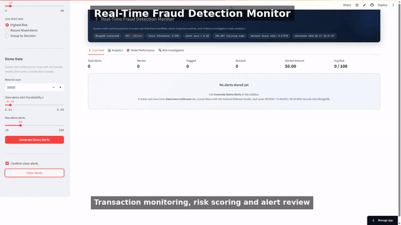
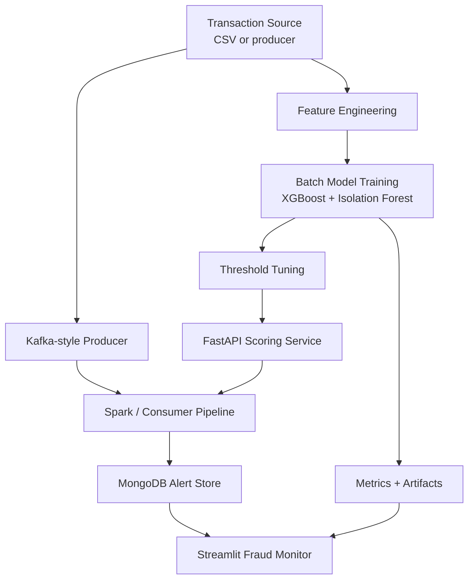

# Real-Time Fraud Detection System

**GitHub Repository:** [praveenraj9623-sketch/Real-Time-Fraud-Detection-System](https://github.com/praveenraj9623-sketch/Real-Time-Fraud-Detection-System)

> A real-time fraud monitoring platform with transaction scoring, XGBoost and anomaly models, Kafka-style streaming components, MongoDB storage, FastAPI scoring endpoints, threshold tuning, risk investigation views, and a Streamlit monitoring dashboard.

[](https://python.org)
[](https://kafka.apache.org)
[](https://spark.apache.org)
[](https://fastapi.tiangolo.com)
[](https://mongodb.com)
[](https://streamlit.io)
[](https://mlflow.org)
[](https://praveenraj9623-sketch.github.io/)
[](https://github.com/praveenraj9623-sketch/Real-Time-Fraud-Detection-System)

---

## Demo Preview



---

## What is This Project?

This project scores card transactions for fraud risk, tunes alert thresholds, stores investigation-ready alerts, and presents a monitoring interface for fraud analysts. It includes a local demo mode so the dashboard can show realistic alerts even without a full Kafka/MongoDB stack.

**Core outcome:** transaction data -> feature engineering -> fraud model -> threshold tuning -> API scoring -> streaming alerts -> dashboard investigation.

---

## System Architecture



---

## Tech Stack

| Category | Tools & Libraries |
|---|---|
| Data Processing | Pandas, NumPy, PySpark |
| Machine Learning | scikit-learn, XGBoost, imbalanced-learn |
| Explainability | SHAP |
| Streaming | kafka-python, local producer/consumer demo |
| Storage | MongoDB, PyMongo |
| API | FastAPI, Uvicorn |
| Dashboard | Streamlit, Plotly, Matplotlib |
| Experiment Tracking | MLflow |
| Deployment | Docker, Docker Compose |
| Testing | pytest |

---

## API Endpoints

Start the API locally:

```bash
uvicorn src.api.main:app --reload --host 0.0.0.0 --port 8001
```

| Method | Endpoint | Purpose |
|---|---|---|
| `GET` | `/health` | API health check |
| `POST` | `/score` | Score one transaction |
| `POST` | `/batch-score` | Score a batch of transactions |

API docs:

```text
http://127.0.0.1:8001/docs
```

---

## Quick Start

```bash
git clone https://github.com/praveenraj9623-sketch/Real-Time-Fraud-Detection-System.git
cd Real-Time-Fraud-Detection-System
python -m venv .venv
.venv\Scripts\activate
pip install -r requirements.txt
streamlit run app.py --server.port 8502
```

The dashboard opens at:

```text
http://127.0.0.1:8502
```

---

## Docker Workflow

```bash
docker compose up --build
```

Use Docker when you want the API, dashboard, and supporting services to run together.

---

## Project Structure

```text
Real-Time-Fraud-Detection-System/
|-- app.py
|-- Dockerfile
|-- docker-compose.yml
|-- requirements.txt
|-- data/demo/
|-- docs/
|-- models/
|-- tests/
`-- src/
    |-- api/
    |-- dashboard/
    |-- modeling/
    |-- processing/
    |-- storage/
    |-- streaming/
    `-- utils/
```

---

## Key Outputs

| Output | Description |
|---|---|
| `models/model_metrics.json` | Model evaluation metrics |
| `models/optimal_threshold.txt` | Selected fraud alert threshold |
| `models/threshold_tuning_summary.json` | Threshold tuning report |
| `models/training_stats.json` | Training summary |
| `data/demo/demo_alerts_seed.json` | Dashboard demo alert seed data |

---

## Running Tests

```bash
pytest -q
```

---

## Limitations

- Fraud systems require live monitoring, feedback loops, and investigation outcomes before production decisions.
- Thresholds must be tuned to business cost and false-positive tolerance.
- Demo alerts are useful for portfolio review but are not a substitute for real streaming traffic.

---

## Future Improvements

- Add real-time feature store integration.
- Add analyst feedback loop for reviewed alerts.
- Add drift and fraud-pattern monitoring.
- Add authentication and role-based alert review.

---

## Author

Built by **Praveen Raj A**

- Portfolio: https://praveenraj9623-sketch.github.io/
- LinkedIn: https://www.linkedin.com/in/praveen-raj-a-b05abb2a3/
- GitHub: https://github.com/praveenraj9623-sketch
- Repository: https://github.com/praveenraj9623-sketch/Real-Time-Fraud-Detection-System
